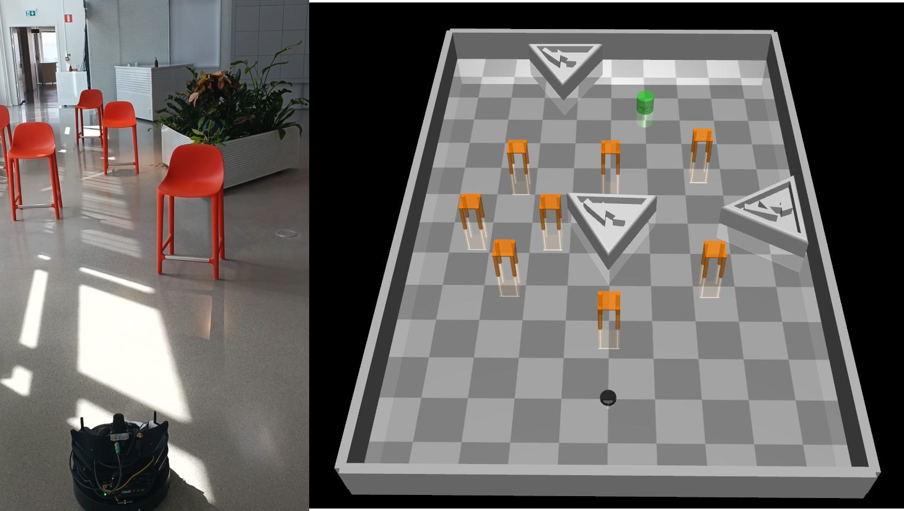
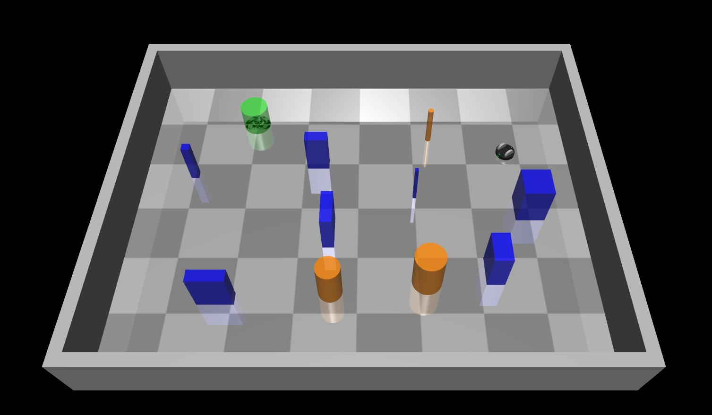
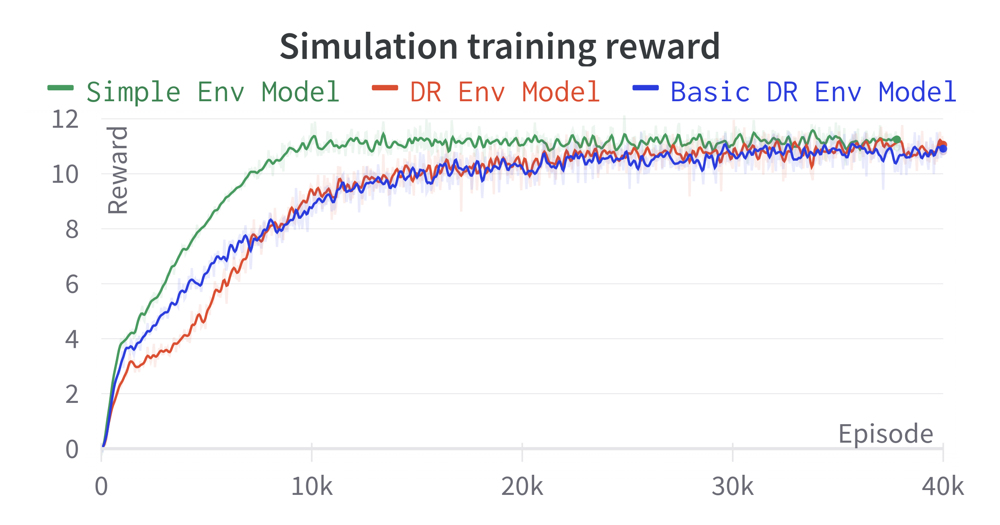
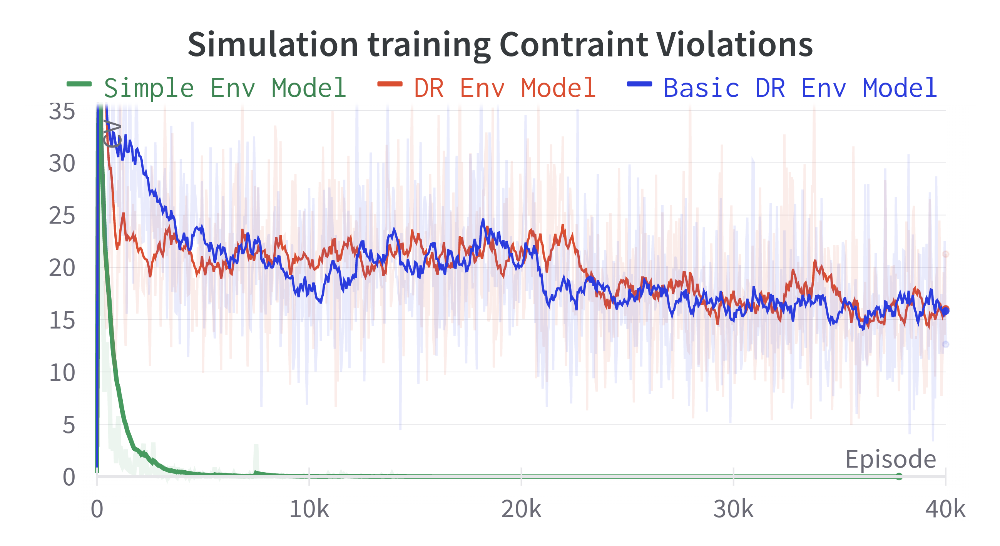
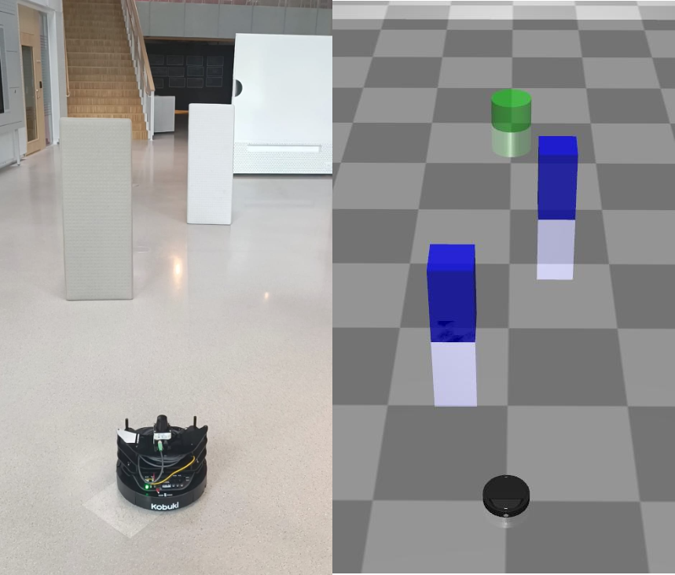
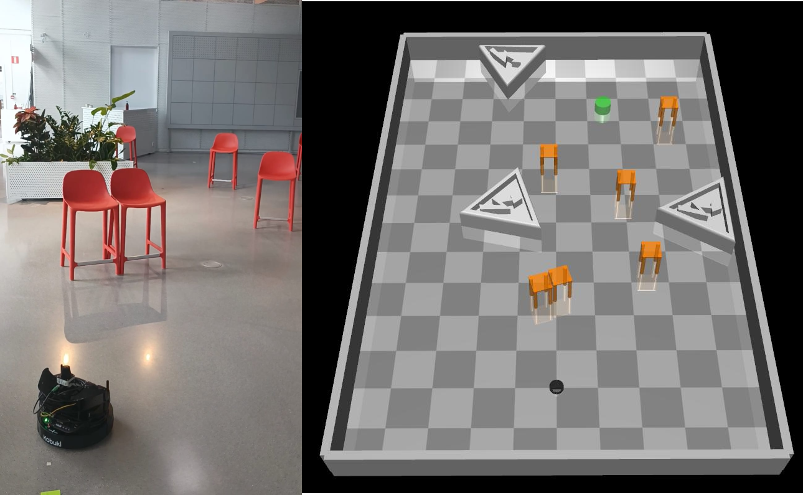
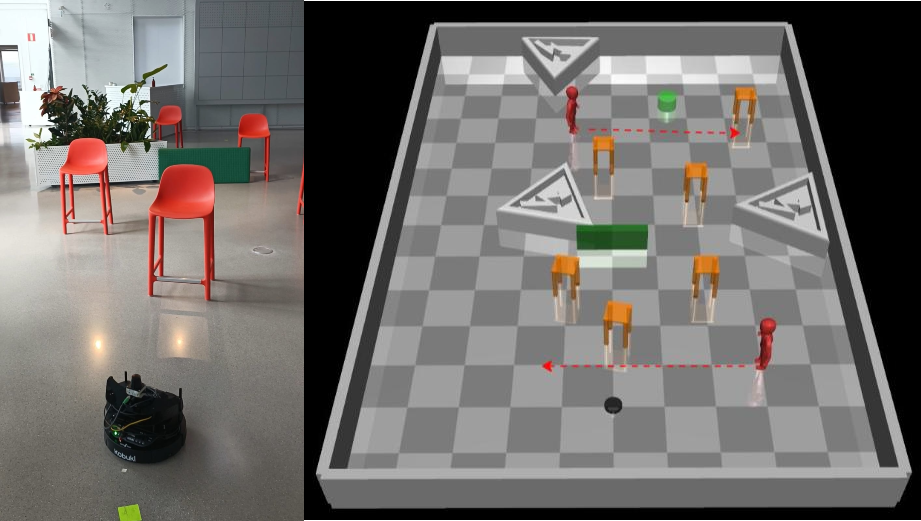

# 1. Overview

Welcome to the repository for Safe Reinforcement Learning (SRL) for real robots. This repository showcases a model's journey to navigate complex environments safely while bridging the sim-to-real gap using Lidar sensor. Discover how Domain Randomization plays a pivotal role in enhancing model generalization from simulations to real-world scenarios. With simulated training in SafetyGym and real-world tests using ROS and the TurtleBot 2i, witness if DR improves safety, performance or enables this robot to excel in critical real-world situations.


# 2. Features

- **Trust Region Conditional Value at Risk (TRC) Algorithm**: Leveraging TRC for safe reinforcement learning.
- **Domain Randomization (DR)**: Enhancing model generalization from simulations to real-world scenarios.
- **SafetyGym Simulator**: Used for simulated training, built on the MuJoCo physics engine.
- **Robot Operating System (ROS)**: Utilized for real-world tests with the TurtleBot 2i platform equipped with LiDAR for perception.
- **Python**: Primary programming language and library for script development.
- **NumPy, SciPy, and Torch**: Utilized for numerical computation, scientific computing, and deep learning.

# 3. Requirements

This project requires to install the following python version and libraries: 

1. Python 3.7 or greater 
2. gym==0.26.2 or greater
3. mujoco-py
4. safety-gym
5. stable-baselines3==1.5.0
6. numpy==1.24.2
7. torch==1.10.0
8. wandb
9. pynput

In case of problems installing mujoco-py or safety-gym there is a detailed .pdf tutorial in this folder called: Installation_tutorial_SafetyGYM_Mujoco

# 4. Results
Lorem ipsum

## Simulation Results
Lorem ipsum







## Real World Results
Lorem ipsum
[](https://youtu.be/zLOIfi8Lnxg)

[](https://youtu.be/m4fElZZIkFI)

[](https://youtu.be/sLtSUiQ4QWw)


# 5. Usage

For everything related to the simulation run the main_TRC.py script, for everythin related to the real Turtlebot run the main_fttraining.py to test the trained model or train in real world. The main parameters are explained inside of each main script. Here is an example parameter configuration for each case:

### **Simulation training** 

In the src folder excecute this command to train a model named trc_model for 1000000 episodes or until you stop the training:

```
python main_TRC.py --total_steps 1000000 --model_name trc_model 
```
> **Note:** It will save a trained model every 100000 time steps (defined by --save_freq) and will be numbered in ascending order.

### **Simulation testing** 

In the src folder excecute this command to test the 10th trained model named trc_model for 100 episodes or until you stop it:
```
python main_TRC.py --model_name trc_model --test --load_model 10
```
> **Note:** The model name has to be the same as the trained model and the model number has to exists in: /tbot/src/results/saved_model.


###  **Real world testing and training** 

First make sure the Turtlebot is on and connected to the Lidar SICK TIM 551. Then excecute the following launch file:
```
roslaunch tbot rob_lidar_loc.launch
```
This launch file will excecute three different launch files required for this task which are: Lidar SICK TIM 551, Robot TF and Localization.
For testing the trained model excecute the following command:
```
python main_fttraining.py --model_name trc_model --goal_x 4 --goal_y 1
```
This will load the trained model named trc_model and will go to the objective position (4, 1) and come back to the initial position.

> **Note:** The detailed information about each parameter is included in the main_fttraining.py script.

For training in real world excecute the same command but with the following parameters' values:

```
python main_fttraining.py --model_name trc_model --fine_tune_training --goal_x 4 --goal_y 1
```
This will load the trained model named trc_model as a starting model and start the training. To stop the robot and report a crash press x, to stop the robot and finish the episode press f, and then wait for instructions indicated in the command window.